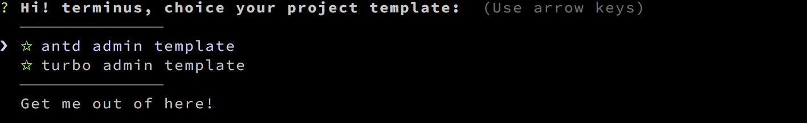

# teu-cli 


A simple CLI for scaffolding react&redux&webpack projects
---



## What's teu-cli ?
teu-cli helps you to kickstart new projects, prescribing best practices and tools to help you stay productive.

## Installation
Prerequisites: [Node.js](https://nodejs.org/en/) (>=4.x, 6.x preferred) and [Git](https://git-scm.com/).
``` bash
$ npm install -g teu-cli
```

## Usage
``` bash
$ teu

 Usage: teu <command> [options]


  Commands:

    init|i   create project template

  Options:

    -h, --help     output usage information
    -V, --version  output the version number
    -u, --update   update CLI to last
```
example
``` bash
$ teu init
? Hi! <User>, choice your project template:  (Use arrow keys)
  ──────────────
❯ ✩ antd admin template
  ✩ turbo admin template
  ──────────────
  Get me out of here!
```
choice template
``` bash
? Hi! <User>, choice your project template:  ✩ antd admin template
✔ 模板下载成功
? 请输入项目名称:  (antd-admin) # 默认会在当前目录创建 andt-admin 自行定义项目名称

+-------------------------------------------------+
|                                                 |
|                                                 |
|      cd antd-admin && npm install               |
|      开发: npm run dev                           |
|      mock: npm run mock                         |
|      生产: npm run prod                          |
|                                                 |
|                                                 |
+-------------------------------------------------+
```
## Official Templates
All Official project template are repos in the [turbo adminTemplate](https://github.com/zmGitHub)

Current available templates include:
- [turbo admin](https://github.com/zmGitHub/turbo-admin)
- [antd admin](https://github.com/zmGitHub/antd-admin)


## Changelog

See the [release page](https://github.com/yeoman/yo/releases).
## License

[MIT](http://opensource.org/licenses/MIT)
